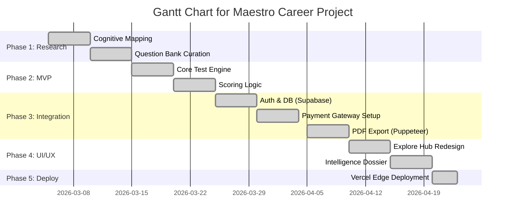
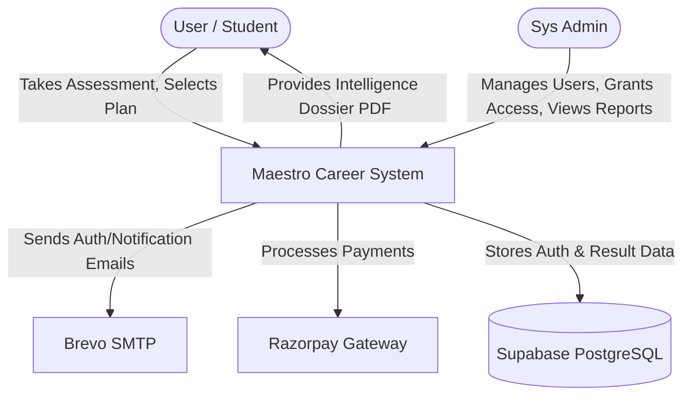
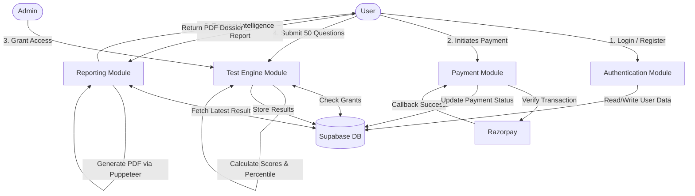
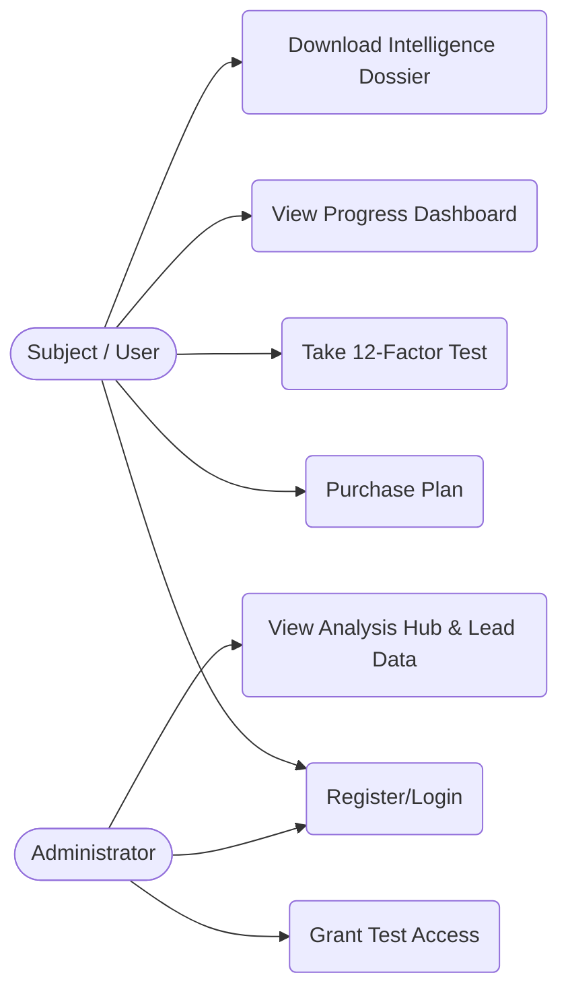
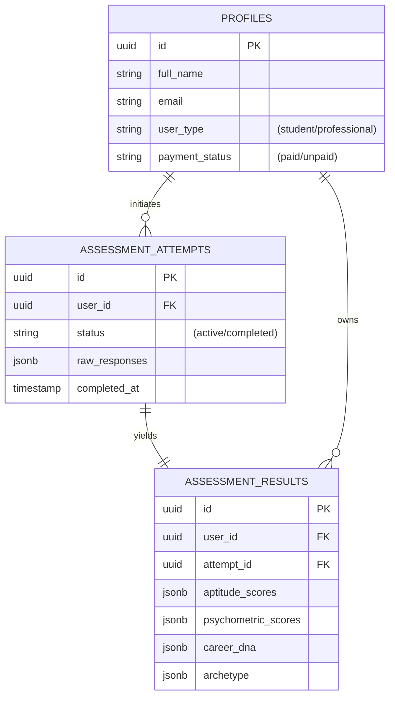
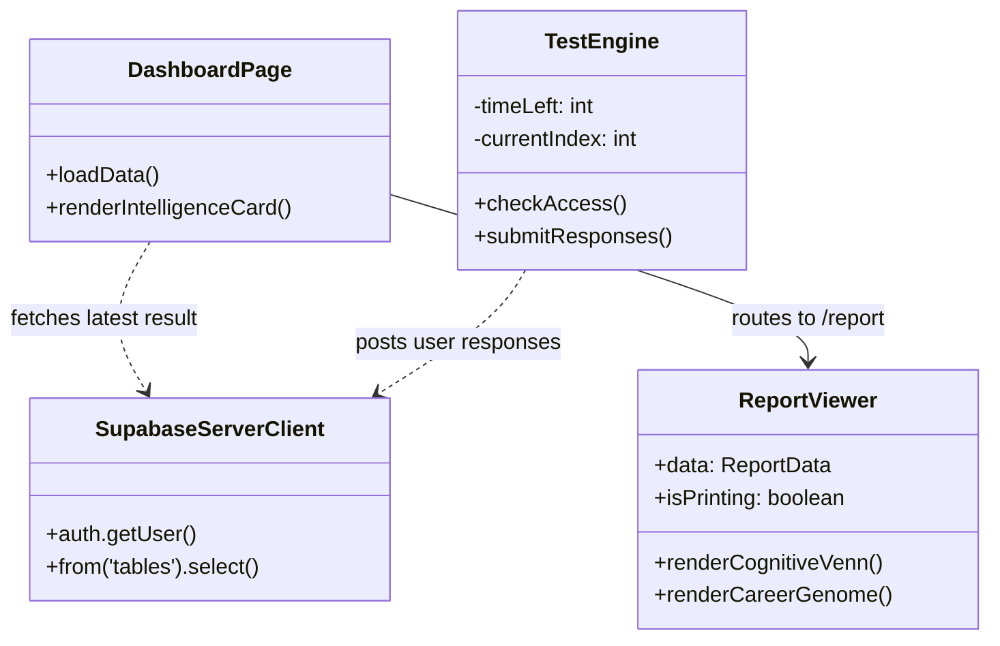
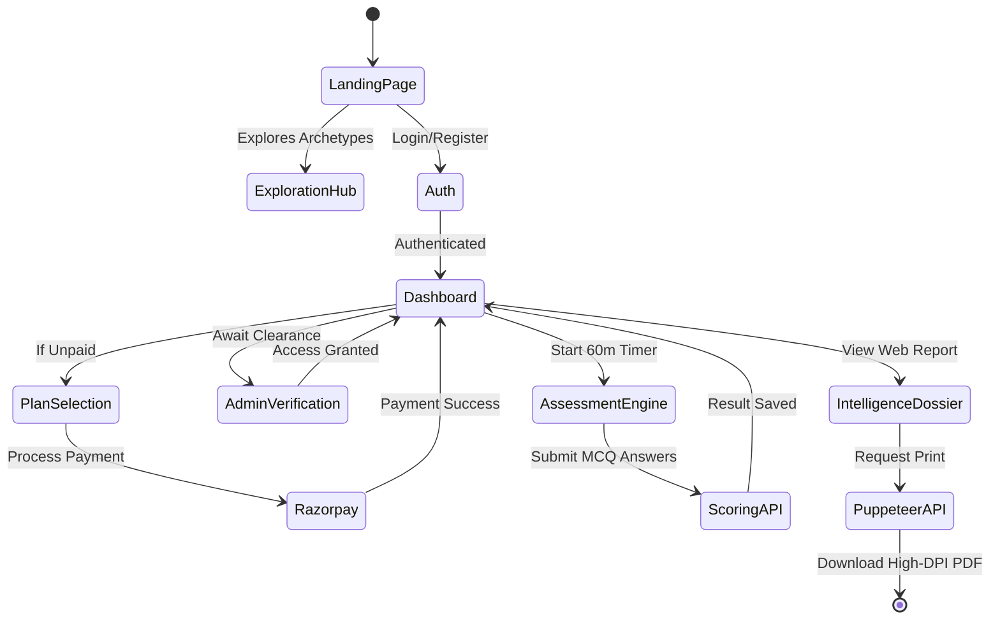

# Maestro Career - List of Figures & Diagrams

This document translates your requested figure list into the **Maestro Career** architecture context. It contains standard **Mermaid.js** code blocks that you can copy into any Markdown viewer (like GitHub or Notion), or paste into [Mermaid Live Editor](https://mermaid.live/) to instantly generate high-quality images for your project report.

---

## 3. System Analysis Diagrams

### 3.1 Gantt Chart for Maestro Career Project
*Shows the agile development life cycle of the platform.*

### 3.2 DFD Level 0 – Maestro Career System
*High-level context diagram showing major external entities.*

### 3.3 DFD Level 1 – Maestro Career System
*Detailed data flow between subsystems.*

### 3.4 Maestro Career Use Case Diagram
*System interactions based on actor roles.*

---

## 4. Architectural Design

### 4.1 ER Structure of the Maestro Career System
*Core entity-relationship mapping for the assessment database.*

### 4.2 Application Component Structure
*React/Next.js frontend architectural relationship.*

### 4.3 End-to-End User Workflow
*State diagram of the user journey from landing page to PDF generation.*

---

## 6. Implementation User Interfaces (Screenshots Checklist)

*Because these must be actual screenshots of the application running, here is the tailored list of 8 screenshots you should capture directly from your `localhost:3001` or Vercel deployment to place in your project report document.*

* **Figure 6.1**: **Landing Page of Maestro Career** showing the Hero section and 3D UI aesthetics.
* **Figure 6.2**: **Intelligence Discovery Engine (`/explore`)** showing the Archetype Matrix and Cognitive Dial in dark mode.
* **Figure 6.3**: **Secure Authentication Interface (`/login`)** showing the email/password and Google login panel.
* **Figure 6.4**: **User Data & Progress Dashboard (`/dashboard`)** showing the "Active Plan" and the green "Intelligence Analysis Ready" card.
* **Figure 6.5**: **Timed Assessment Engine Interface (`/test`)** showing the 60-minute countdown timer and the interactive MCQ selection layout.
* **Figure 6.6**: **Admin Analysis Hub (`/admin/dashboard`)** showing the internal lead management table, "Grant Test Access", and "Fetch PDF" controls.
* **Figure 6.7**: **Intelligence Dossier Web View (`/report`)** focusing on the Global Percentile Rank, pure SVG Cognitive Venn, and Radar Charts.
* **Figure 6.8**: **Final Downloaded Print-Ready PDF output** of the Intelligence Dossier (showing A4 formatting).
